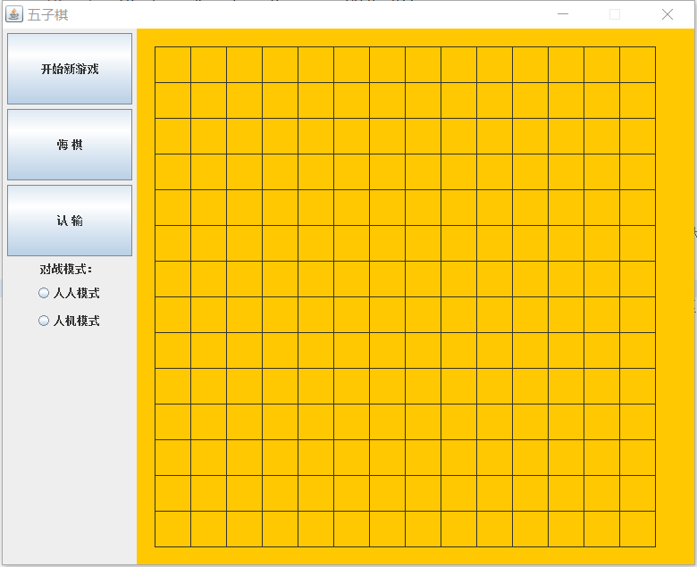
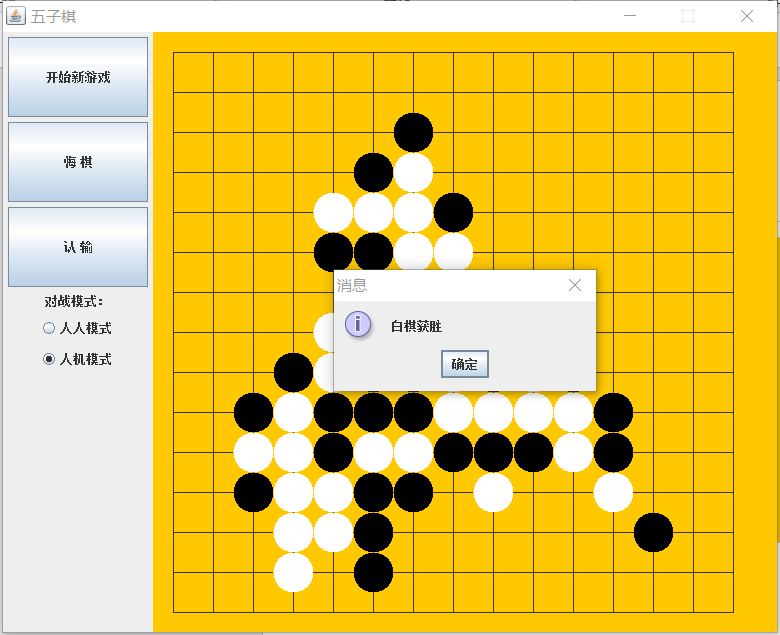

# Five_Chess
## Java五子棋
实现人机/人人对战，采用权值法作为核心算法，通过判断权值的大小决定优先将棋子落在哪个位置。
## 功能模块
### FiveChess接口
存放全局需要使用的数据，以便传输。基本上就是棋盘上的数据，比如FiveChess接口：棋盘格子的大小，棋盘的行数、列数，棋盘每个位置的权值，记录棋子位置的数组等。
### FiveChessMain类
这是一个主类，使用awt创建图形界面包对整个界面的布局进行设计，包括棋盘的大小、颜色，功能按钮的命名和位置， 并且使用Graphics画笔重绘棋盘，使棋盘从开始就一直存在。
### FiveChessListenner类
这是一个下棋类，使用鼠标事件监听（MouseAdapter）和动作监听（ActionListener）来对鼠标点击的位置进行下棋，对选择的模式进行人人对战和人机对战，以及在下棋过程中的动作：认输和悔棋（人机对战中不可悔棋），同时还使用画笔Graphics将棋子画到棋盘上。
### Chess类
棋子类，确认棋子的行号和列号，也就是它的位置，以及黑白子两种颜色。
### ArrayList类
数组列表类，用来记录棋子位置的数组，在后期Judge类进行判断输赢，以及在AI算法中进行权值计算。
### Judge类
判断输赢类，方法是遍历所有的棋子，只要有五个连在一起就算赢。
### AI类
核心算法，采用权值法，通过判断权值的大小，决定优先下棋的位置（把两方都没有被围堵的棋叫“活”，把一方被围堵的棋叫“眠”）。
## 实现效果
### 棋盘界面

### 游戏界面

